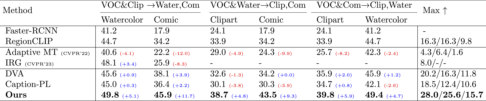

> **Semi-Supervised Domain Generalization for Object Detection via Language-Guided Feature Alignment (CDDMSL)** <br>
> [Sina Malakouti](https://www.linkedin.com/in/sinamalakouti) and [Adriana Kovashka](https://people.cs.pitt.edu/~kovashka/)<br>

This is the official repo for Semi-Supervised Domain Generalization for Object Detection via Language-Guided Feature Alignment (BMVC2023)

Please contact [Sina Malakouti](https://sinamalakouti.github.io/) at sem238(at)pitt(dot)edu or siinamalakouti(at)gmail(dot)com for any questions or more information.

[**arXiv**](https://papers.bmvc2023.org/0444.pdf) | [**Official BMVC Proceeding**](https://papers.bmvc2023.org/0444.pdf) | [**Video**](https://bmvc2022.mpi-inf.mpg.de/BMVC2023/0444_video.mp4) | [**Poster**](https://bmvc2022.mpi-inf.mpg.de/BMVC2023/0444_poster.pdf) | [**Supplement**](https://bmvc2022.mpi-inf.mpg.de/BMVC2023/0444_supp.pdf) | [**BMVC Project Page**](https://proceedings.bmvc2023.org/444/)

**This repo will be updated soon!**

### Methodology
<p align="center">

</p>


### Results

#### Real-to-Artistic Generalization

<p align="center">

</p>


#### Adverse-Weather Generalization

<p align="center">

</p>

## Setup
For installing the project, please see [RegionCLIP](https://github.com/microsoft/RegionCLIP) and [Detectron2](https://github.com/facebookresearch/detectron2).

## Datasets


### Real-to-Artistic
For this task, we used PASCAL-VOC as a labeled domain. Then, either Clipart, Comic, or Watercolor is used as the unlabeled domain. For instance, if Pascal-VOC and Clipart are used as labeled and unlabeled source domains. Then, Comics and Watercolor are the target domains in the DG experiment. 

Please see [here](https://github.com/naoto0804/cross-domain-detection) for downloading the dataset. 

Please see the following files for dataset creation and/or modification: 

- detectron2/data/datasets/pascal_voc.py
- detectron2/data/datasets/builtin.py

### Adverse-Weather

Please download cityscapes and [foggy-cityscapes](https://www.cityscapes-dataset.com/)  as well as the [bdd100k](https://doc.bdd100k.com/download.html). Note that for bdd100k, we only used the validation set. 

Please see the following files for dataset creation and/or modification: 

- detectron2/data/datasets/cityscapes.py
- detectron2/data/datasets/builtin.py. For bdd100k, we used coco to register the data

## Pre-trained files

Please download pre-trained parameters from [Google Drive](https://drive.google.com/drive/folders/1KrXv2KgX5dIBBuPglYsc13oIjh7HRzcG). Will be updated soon to cover all parameters)

You can find checkpoints required for both training and evaluation in the google drive. Some of the available parameters are: 
- RegionCLIP pretrained parameters
- Text Embedding (VOC)
- Text Embedding (Cityscapes)
- Vision-to-Language Transformer
- Real-to-Artistic Parameters
- Adverse-Weather parameters


## Training 

- Example for training a real-to-artistic generalization is available in faster_rcnn_voc.sh
- Example of training an adverse-weather generalization is available in faster_rcnn_city.sh

## Inference
During training, we evaluate all source and target domains. However, for inference only, please set the weights of the modules and add the flag --eval-only in the bash file. 


## ClipCap training
We have provided the pre-trained parameters for the ClipCap mapping-network [here](https://drive.google.com/drive/folders/1agMffWa69paFGYs3s7ADT8VxStCWSTEt). 
If you wish to do the pre-training, please follow the following steps: 

- Follow the instructions on [ClipCap](https://github.com/rmokady/CLIP_prefix_caption) to install the project and download the coco dataset. 
- Include the [RegionCLIP2CLIP.py](https://github.com/sinamalakouti/CDDMSL/blob/main/clipcap_scripts/%20RegionCLIP2CLIP.py) in the ClipCap repository.
- Replace the parse_coco.py provided [here](https://github.com/sinamalakouti/CDDMSL/blob/main/clipcap_scripts/parse_coco.py) with the one in the main reposotiry. The only difference is that we need to rename some of the parameters in the RegionClip encoder so that the naming format matches the CLIP's naming to successfully train the mapping network.
- Then execute the following commands:

```
python parse_coco.py --clip_model_type RN50
```
```
python train.py --only_prefix --data ./data/coco/oscar_split_RN50_train.pkl --out_dir ./coco_train/ --mapping_type transformer  --num_layres 8 --prefix_length 40 --prefix_length_clip 40 --is_rn
```

# Other Information
- For training/inference of the RegionCLIP pre-trained model, please refer to [here]((https://github.com/microsoft/RegionCLIP)).

# Citation
If you find this repo useful, please consider citing our paper:

```
@article{malakouti2023semi,
  title={Semi-Supervised Domain Generalization for Object Detection via Language-Guided Feature Alignment},
  author={Malakouti, Sina and Kovashka, Adriana},
  journal={arXiv preprint arXiv:2309.13525},
  year={2023}
}
```

## Acknowledgement
This repo is based on Detectron2 and RegionCLIP repositories. 
